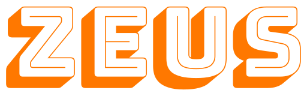

# Cloud-native power bar ⚡

Zeus is a cloud-native power bar that allows you to monitor your power consumption and control your appliances.

## Features ✨

- **Prometheus metrics 📈**  
  Power and energy measurements are exposed as Prometheus metrics. Use this in combination with tools such as Grafana to visualize the data.

- **Automatic firmware updates 📡**  
  Firmware updates are automatically installed on the device based on the latest firmware available on GitHub.

- **REST API 🔌**  
  Control the power state of your connected devices via a simple REST API.

## Concept 📐

Zeus is an hardware platform for power monitoring and management. It is built around the ESP32. The idea is to add power monitoring for devices that do not support it natively. The metrics are collected and then exposed via endpoints that can be scraped by Prometheus.

The block diagram illustrates the core components of the hardware platform. In the front, the device will feature an RJ45 connector for Ethernet 100Base-TX Ethernet and a USB 2.0 type C port for programming and a serial console. It will also feature a single C14 plug for power input as well a multiple C13 power outputs. All outputs will have seperate power monitoring circuits, allowing distinct power monitoring. Additionally, Zeus will allow simple, remote out-of-band management via the following ports:

- 2-pin 5V power output
- 4-pin 5V PWM fan control
- 2-pin NTC temperature sensor
- 2-pin 5V UART interface

## Attributions ❤️

- [Bungee Shade][google-fonts-bungee-shade] font by [David Jonathan Ross][website-djr]

## License 📄

This project is and will always be licensed under the [Apache 2.0 license][file-license].

<!-- Please find the list of references below. -->

[google-fonts-bungee-shade]: https://fonts.google.com/specimen/Bungee+Shade
[website-djr]: https://djr.com/about
[file-license]: ./LICENSE.md
